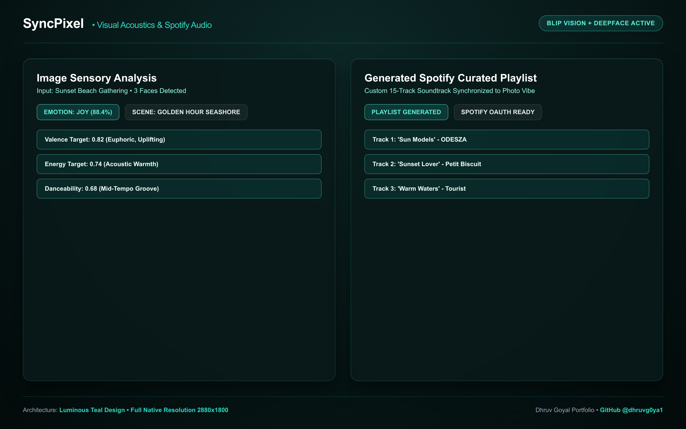

# SyncPixel

**Upload a photo, get a playlist that matches its mood.** SyncPixel reads two
independent signals out of one image - the emotion on a face and the scene
itself - and turns them into a Spotify query tuned on valence, energy and
danceability.

[](https://www.python.org/)
[](https://streamlit.io/)
[](https://pytorch.org/)
[](https://developer.spotify.com/)
[](https://ai.google.dev/)

---

## How it works

Most "mood playlist" tools classify a single label and search for it. SyncPixel
fuses two modalities, because a smiling face at a funeral and a smiling face at a
beach should not return the same music.

```
                  ┌──────────────────────┐
                  │      uploaded image  │
                  └──────────┬───────────┘
                             │
              ┌──────────────┴──────────────┐
              ▼                             ▼
   ┌────────────────────┐        ┌──────────────────────┐
   │ DeepFace           │        │ BLIP                 │
   │ 7-way emotion      │        │ caption + VQA on     │
   │ distribution       │        │ setting, objects,    │
   │                    │        │ time of day          │
   └─────────┬──────────┘        └──────────┬───────────┘
             │                              │
             └──────────────┬───────────────┘
                            ▼
              ┌──────────────────────────────┐
              │  emotion -> genre seeds       │
              │  emotion -> target valence,   │
              │  energy, danceability         │
              └──────────────┬───────────────┘
                             ▼
              ┌──────────────────────────────┐
              │  Spotify Web API             │
              │  recommend + search, then    │
              │  filter on language, length  │
              │  and release recency         │
              └──────────────┬───────────────┘
                             ▼
              ranked tracks + Gemini-written captions and hashtags
```

## Features

| | |
|---|---|
| **Two-signal fusion** | DeepFace emotion distribution and BLIP scene understanding, combined rather than used alone |
| **Audio-feature targeting** | Each emotion maps to target valence, energy and danceability, so results are matched on how a track *feels*, not just its genre tag |
| **Batched API calls** | Genre seeds fetched once per session and cached; artist and audio-feature lookups batched, cutting request count substantially |
| **Language filtering** | Hindi/English detection by script and keyword, so results match what you actually listen to |
| **Generated copy** | Gemini 2.5 Flash writes captions and hashtags for the image, seeded by the detected emotion |
| **Reactive theming** | The whole UI recolours to match the detected emotion |

## Layout

```
app.py                  Streamlit entry point (UI flow only)
syncpixel/
├── vision.py           BLIP captioning/VQA, DeepFace emotion classification
├── llm.py              Gemini caption and hashtag generation
├── spotify.py          Web API client: auth, seeds, recommend, audio features
├── recommend.py        emotion -> seeds -> ranked, filtered track list
├── filters.py          language detection, duration, recency
├── ui.py               emotion chart and track cards
└── theme.py            per-emotion colour themes
```

## Quick start

```bash
git clone https://github.com/dhruvg0ya1/SyncPixel.git
cd SyncPixel

python -m venv .venv
source .venv/bin/activate        # Windows: .venv\Scripts\activate
pip install -r requirements.txt
```

Add credentials to `.streamlit/secrets.toml`:

```toml
GEMINI_API_KEY        = "your-gemini-key"
SPOTIFY_CLIENT_ID     = "your-spotify-client-id"
SPOTIFY_CLIENT_SECRET = "your-spotify-client-secret"
```

Then:

```bash
streamlit run app.py
```

**Note on system packages:** DeepFace pulls in OpenCV, which needs `libgl1` and
`libglib2.0-0` on Linux. Both are listed in `packages.txt` for Streamlit Cloud;
install them manually elsewhere.

## Credentials

| Key | Where to get it |
|---|---|
| `GEMINI_API_KEY` | [Google AI Studio](https://aistudio.google.com/) |
| `SPOTIFY_CLIENT_ID` / `SECRET` | [Spotify developer dashboard](https://developer.spotify.com/dashboard) |

Secrets are read through `st.secrets` and are never committed.

## License

MIT


## Interface Screenshots



## Video Walkthrough

A full 1080p Loom-style product walkthrough is available at [`videos/loom_demo_walkthrough.mp4`](./videos/loom_demo_walkthrough.mp4).
